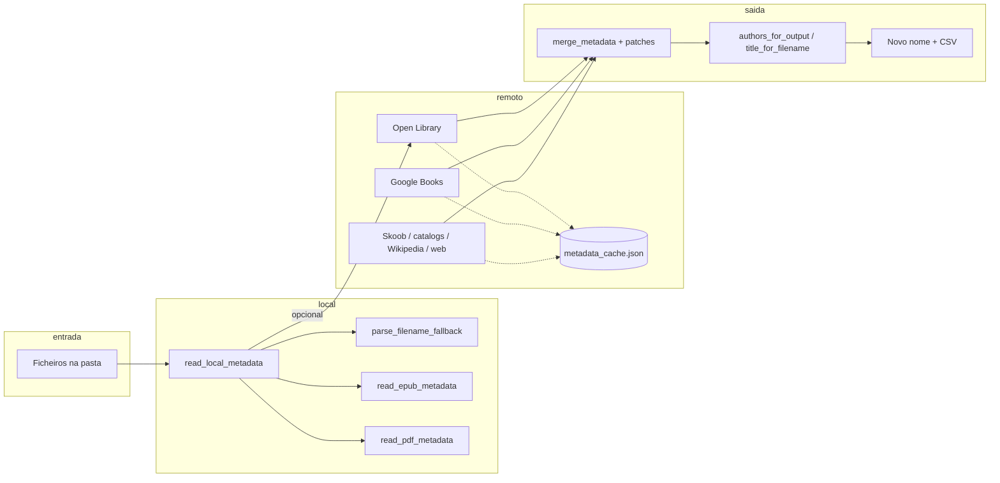

# Arquitetura do sistema

Visão de como o **renomear-ebooks** está organizado: fluxo de dados, subsistemas e pontos de extensão. O detalhe de flags e exemplos de CLI permanece no README.

## Visão geral

O programa é um **CLI monolítico** (`renomear_ebooks.py`) que:

1. Varre pastas de livros (com filtros de extensão e exclusões).
2. Extrai **metadado local** (nome do ficheiro + conteúdo leve de EPUB/PDF).
3. Opcionalmente **completa ou corrige** com **APIs/HTML** (Open Library, Google Books, Skoob, catálogos via DDG, Wikipedia, web).
4. **Funde** resultados com regras configuráveis e heurísticas de confiança.
5. Gera **novo nome de ficheiro** e **artefatos** (CSV de plano/log, cache HTTP, opcionalmente revisão interativa).

O modelo central de dados é **`BookMeta`** (`dataclass`): caminho, título, autores, ano, ISBN, editora, série, assuntos, fonte, confiança, notas, sufixos de volume/edição vindos do nome, e (em runtime) evidência/“match score”.

## Organização do código (por responsabilidade)

Tudo vive num único módulo; a separação é **lógica**, não por pacotes.

| Área | Funções / tipos típicos |
|------|-------------------------|
| CLI e orquestração | `main()`, `run_on_root()`, `build_local_metadata()`, `iter_files()` |
| Logging | `log_info`, `log_warn`, `log_error`, `log_fatal`, `append_note` |
| Núcleo de metadado | `BookMeta`, `merge_metadata`, `lookup_metadata`, `compute_match_evidence` |
| Nome de ficheiro (parse) | `parse_filename_fallback`, `_bipartite_split_once`, heurísticas de autor vs título |
| Leitura embutida | `read_epub_metadata`, `read_pdf_metadata`, `read_local_metadata` |
| Rede e cache | `get_json`, `cache_key`, `*_safe_zip_read` (limites de tamanho) |
| Fontes remotas | `best_openlibrary`, `best_googlebooks`, `best_skoob_year`, `best_book_catalogs_ddgs_year`, `best_wikipedia`, `best_web_year` |
| Pós-processamento | `patch_meta_from_filename_if_merged_suspect`, `enrich_weak_authors_from_web`, `_recover_authors_from_google_by_title` |
| Saída de nomes | `default_filename_stem`, `make_new_filename`, `authors_for_output`, `title_for_filename`, `format_one_author`, `unique_target` |
| Dados auxiliares | `SupplementaryIndex`, `load_supplementary_data`, CSV de apoio |
| Utilitários | `normalize_for_match`, `safe_filename_part`, `year_from_string`, etc. |

## Pipeline por ficheiro (dentro de `run_on_root`)

1. **`iter_files`** — Lista candidatos; exclui pasta `renamed/` quando apropriado; aplica extensões permitidas e regras de pastas ignoradas.
2. **`build_local_metadata`** — Usa *thread pool* (`concurrent.futures`) para, por ficheiro, chamar `read_local_metadata` (EPUB/PDF ou stub) e combinar com **`parse_filename_fallback`**.
3. **`prioritize_triplet_filename_over_local`** — Se o stem seguir padrão triplo (autor–ano–título ou ano–autor–título), o nome do ficheiro pode **sobrepor** metadado embutido.
4. **Decisão offline vs remoto** — Com `--source offline`, ano já presente sem `--force-remote`, ou ficheiro em triplete “completo” no nome, evita-se `lookup_metadata`.
5. **`lookup_metadata`** — Orquestra fontes remotas (subconjunto definido por `--sources` / perfis de velocidade), usa **`metadata_cache.json`**, faz **`merge_metadata`** com campos `--remote-metadata` / `--keep-local-metadata`. Pode sair cedo se Open Library devolver registo “confiável”; no fim pode **recuperar autores** só por título (Google Books). O uso remoto é limitado por políticas de execução (`max_remote_calls_per_file`, `max_estimated_cost`, `item_timeout_s`).
6. **`apply_supplementary_merged`** — Incorpora ficheiro suplementar (`--supplementary-data`), por caminho resolvido ou basename.
7. **`patch_meta_from_filename_if_merged_suspect`** — “Failsafe” quando título HASH/t UNKNOWN ou autores absurdos.
8. **`compute_match_evidence`** — Calcula score e dicionário de evidências (útil para `--review`).
9. **`make_new_filename`** — Usa overrides (`author_overrides.json` + locks de revisão), padrão clássico ou `--filename-pattern`.
10. **`unique_target`** — Evita colisões na pasta destino; renomeação real só com `--apply`.
11. **`run_summary.md`** — Consolida estatísticas de execução e padrões de falha/ambiguidade.

## Subsistemas importantes

### Parse do nome do ficheiro

Ordem aproximada: saneamento de **ruído** (portais, referências tipo CIA), **normalização de travessões**, **underscore como subtítulo** (substituto de `:`), regras de **triplete** e **bipartição** (autor | título), com pontuações de “parece autor” vs “parece título”. Parênteses finais podem ser **título (nota)** ou **título (autor)** consoante o conteúdo.

### Metadado local vs remoto

- **Local** é sempre a base; remoto **preenche ou sobrescreve** conforme `merge_metadata` e listas de campos.
- Há heurísticas para **autores de parse duvidosos** (`_authors_look_suspicious`) que favorecem remoto confiável.
- PDFs com nome estruturado **priorizam** autor/título do ficheiro e filtram anexos de metadado (ex.: tradutor) quando não batem com o autor inferido do nome.

### Rede

- **Sessão HTTP** reutilizável (pool, User-Agent).
- **Cache em disco** por hash de URL+query; errors e HTML truncados entram na cache para não martelar o mesmo endpoint.
- Delays configuráveis (`--sleep`, perfis `--fast` / `--thorough` / `--search-speed`).
- Camada de previsibilidade por execução: limite de chamadas remotas por item, teto de custo estimado e timeout total por item.

### Saída

- CSV de plano ou log com colunas normalizadas (incl. anti-formula em células).
- Pastas de saída: por defeito `PASTA/renamed/` (ou a própria pasta se já for `renamed`).
- Artefatos adicionais: `phase_artifacts.json`, `run_summary.md`, e no modo planejamento `planning_only.md`/`planning_only.json`.

## Pontos de extensão (sem alterar o núcleo)

- **`author_overrides.json`** — Correções manuais de formato de autor.
- **`--supplementary-data`** — CSV/JSON com metadado extra fundido por caminho ou nome de ficheiro.
- **Flags de merge** — Quais campos o remoto pode alterar e quais permanecem locais.

## Relação com outros documentos

- **`PROJECT.md`** — Versões Python, ferramentas de qualidade, convenções estáveis.
- **`README.md`** — Comportamento do utilizador, exemplos e opções detalhadas.

Este ficheiro descreve estrutura e fluxo de dados; não duplica tabelas de CLI (ver README).
